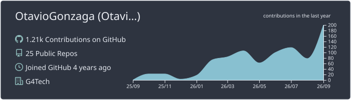
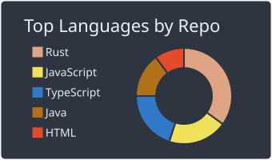
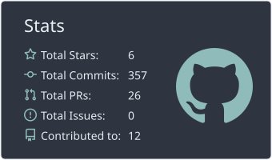

# Otavio Luiz Gonzaga

**Backend developer · Software architecture · Rust · Infrastructure**

I build APIs, developer tools, and infrastructure with a focus on maintainability, domain modeling, and clear architectural boundaries. I work primarily with **TypeScript / Node.js** and **Rust**, and I'm studying **Software Engineering at UTFPR**.

  
  
  

## Technologies

  

| Area | Tools & practices |
| --- | --- |
| **Backend** | TypeScript, Node.js, NestJS, Rust, REST APIs |
| **Architecture** | Domain-Driven Design, Ports & Adapters, event-driven systems |
| **Data** | PostgreSQL, SQLite, Prisma, SeaORM |
| **Infrastructure** | Linux, Docker, Podman, GitHub Actions, Nginx, Traefik, OpenTelemetry |
| **Frontend** | React, React Native |

## Selected projects

### [kmux](https://github.com/OtavioGonzaga/kmux)

A Linux CLI that gives a command a filtered view of an existing SSH agent. Only selected keys are available to the child process; private keys stay in the upstream agent.

**Rust · Linux · OpenSSH · Unix sockets · Security**

### [Windwatcher](https://github.com/OtavioGonzaga/windwatcher)

A self-hosted chat API written in Rust, featuring real-time messaging, authentication, multiple database backends, and Ports & Adapters.

**Rust · Axum · WebSockets · SQLite · PostgreSQL · Hexagonal Architecture**

## GitHub activity

  

  
  

These cards are generated by a scheduled GitHub Action and stored in this repository. Language distribution and public GitHub activity are not measures of proficiency or all development work.
